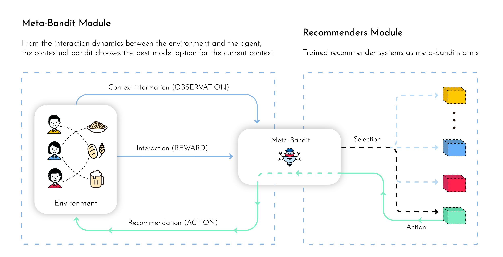

# Meta Bandit Selector



## Dependencies and Requirements
- python=3.6.7
- pandas=0.25.1
- scipy=1.3.1
- numpy=1.17.0
- scikit-learn=0.21.2
- requests=2.18.4
- unidecode==1.1.1
- creme==0.5.1
- bentoml==0.7.8
- pyyaml
- responses==0.10.14
- prometheus_client

### Install

```bash
conda env create -f environment.yml
conda activate meta-bandit-selector
```

## Usage

### Configure Files

#### config.yml

```yaml
arms:
  arm1: http://arm.localhost/predict
  arm2: http://arm.localhost/predict
  arm3: http://arm.localhost/predict
bandit_policy_params:
  epsilon: 0.1
  seed: 42
```

### Build Package

```bash
python pack.py --h

usage: pack.py [-h] [--config-path CONFIG_PATH]
               [--polity-module POLITY_MODULE] [--polity-cls POLITY_CLS]

Process some integers.

optional arguments:
  -h, --help            show this help message and exit
  --config-path CONFIG_PATH
  --polity-module POLITY_MODULE
  --polity-cls POLITY_CLS

```

Package meta-bandit with e-greedy:

```bash
python pack.py --config-path config_egreedy.yml \
--polity-module policy.e_greedy --polity-cls EGreedyPolicy
```

### Predict

http://localhost:5000/predict

#### Format 
```json
{
  "context": {
    // context information for Meta-Bandit
  },
  "input": {
    // input arms 
  }
}
```
#### Example
```bash
curl -i \
  --header "Content-Type: application/json" \
  --request POST \
  --data '{
  "context": {
    "f1": 1,
    "f2": 0
  },
  "input": {
    "user": 1,
    "items": [
      0,
      1,
      3,
      7,
      4,
      6,
      5,
      2
    ]
  }
}' \
  http://localhost:5000/predict
```

### Update

#### Format 

http://localhost:5000/update

```json
{
  "context": {
    // context 
  },
  "arm": "arm1",
  "reward": 1
}
```

## Examples

....


## Test

```bash
python -m unittest tests/src/test_*
```

## Cite
Please cite the associated paper for this work if you use this code:


```
@article{smc2020metabandit,
  title={Contextual Meta-Bandit for Recommender Systems Selection},
  author={Santana, Melo, and Camargo, et al.},
  journal={},
  year={2020}
}
```

## License

Copyright ---

Licensed under the Apache License, Version 2.0 (the "License"); you may not use this file except in compliance with the License. You may obtain a copy of the License at http://www.apache.org/licenses/LICENSE-2.0

Unless required by applicable law or agreed to in writing, software distributed under the License is distributed on an "AS IS" BASIS, WITHOUT WARRANTIES OR CONDITIONS OF ANY KIND, either express or implied. See the License for the specific language governing permissions and limitations under the License.